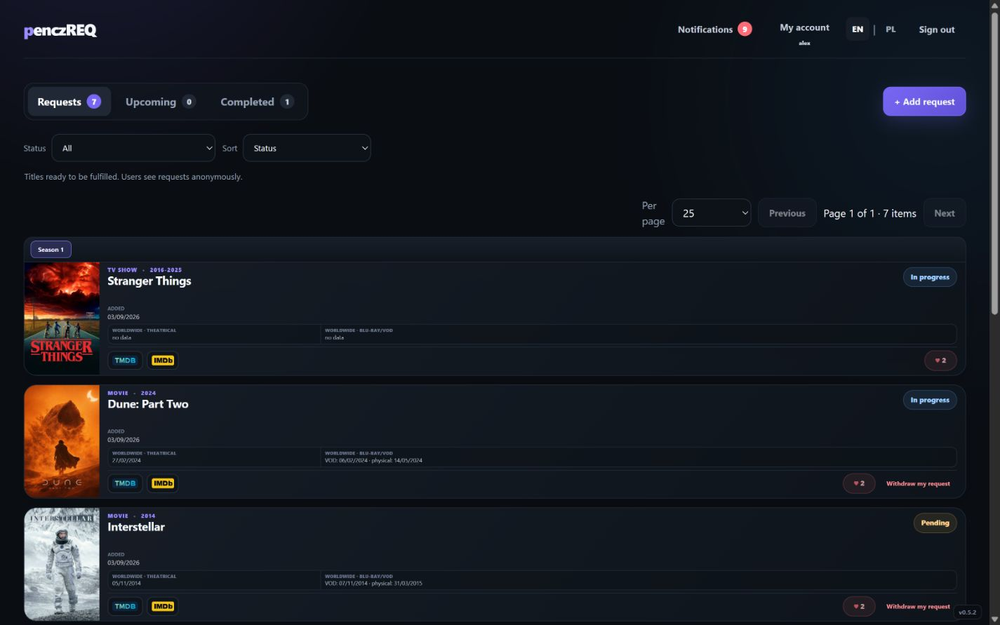
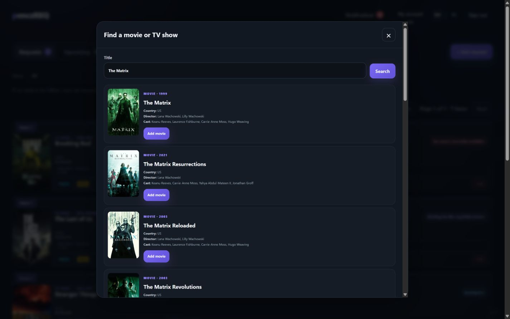
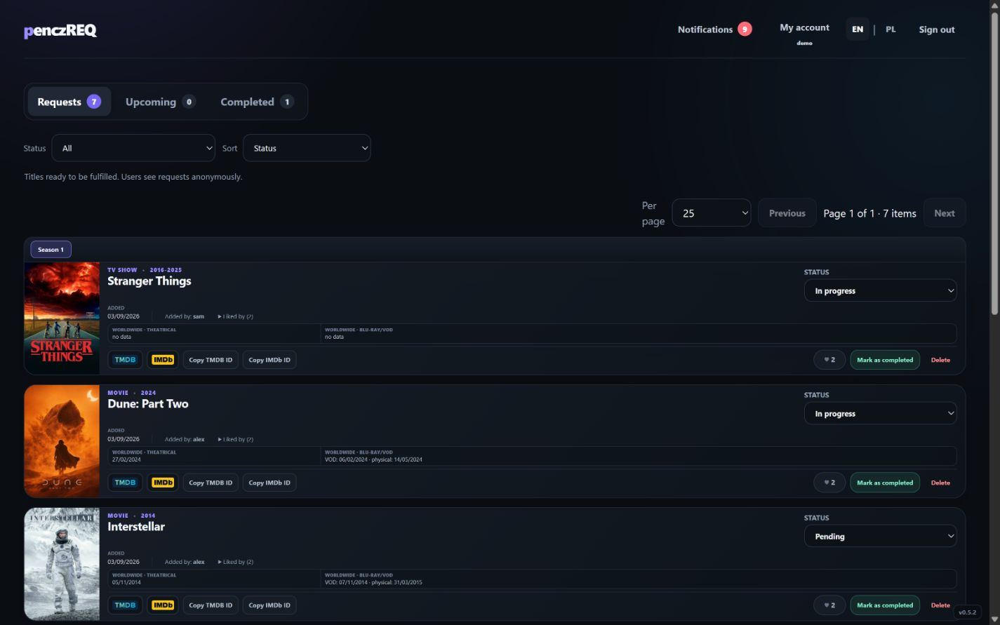
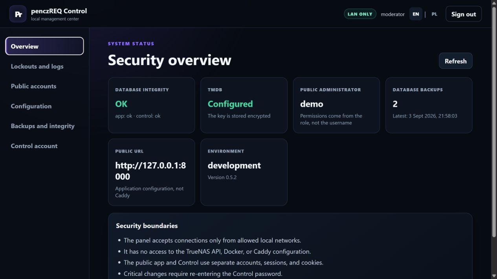
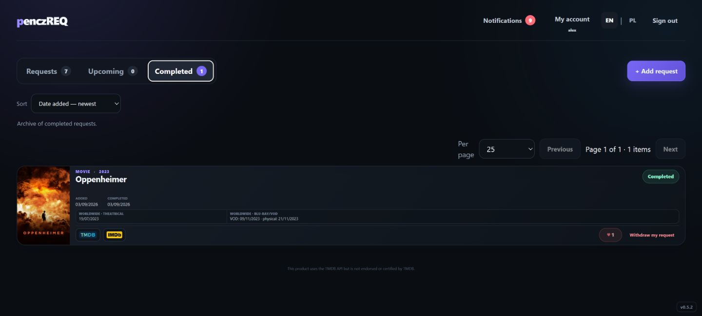
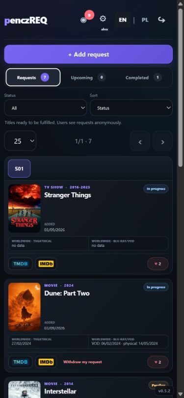

# penczREQ

penczREQ is a self-hosted movie and TV request management companion for
Jellyfin and Plex, with separate public and admin interfaces.

It gives household members a focused place to discover titles through TMDB,
request movies or TV seasons, follow fulfilment, and receive updates. Media
acquisition remains a manual operator decision: penczREQ does not download
content, inspect a media library, or connect to Jellyfin, Plex, Sonarr, or
Radarr APIs.

## Screenshots

<table>
  <tr>
    <td width="50%">
      <strong>Public home</strong><br>
      
    </td>
    <td width="50%">
      <strong>TMDB search</strong><br>
      
    </td>
  </tr>
  <tr>
    <td width="50%">
      <strong>Administrator workflow</strong><br>
      
    </td>
    <td width="50%">
      <strong>Control</strong><br>
      
    </td>
  </tr>
  <tr>
    <td width="50%">
      <strong>Completed requests</strong><br>
      
    </td>
    <td width="50%" align="center">
      <strong>Responsive mobile UI</strong><br>
      
    </td>
  </tr>
</table>

## Features

- Movie and TV-season requests backed by TMDB search, metadata, release dates,
  cast information, and posters.
- Request, upcoming, and completed workflows with status controls, sorting,
  filtering, grouped seasons, and server-side pagination.
- Shared participation through likes, including safe withdrawal when other
  users remain interested.
- Separate Public and Control services with independent accounts, sessions,
  cookies, and databases.
- Role-based Public administration plus private account, lockout, recovery,
  configuration, audit-log, and backup management in Control.
- English and Polish interfaces, localized titles, and translated
  notifications.
- Responsive desktop and mobile layouts.
- Installable network-only PWA with optional Web Push notifications.
- Transactionally consistent paired SQLite backups and integrity checks.
- Independent LAN or reverse-proxy modes for Public and Control.

## Designed for self-hosted media servers

penczREQ complements a Jellyfin or Plex setup without taking control of the
media server. Users submit and follow requests; an administrator decides how
and when each title is fulfilled. There is no media-server, downloader, or
automation API integration in version 0.5.2.

The documented deployment path is TrueNAS SCALE. The installer targets the
TrueNAS SCALE 25.10.x API contract, and version 0.5.2 has been validated on
TrueNAS SCALE 25.10.6. The application itself runs as two Python services in
containers and is not conceptually limited to TrueNAS, but other operating
systems do not yet have an officially supported installer.

## Requirements

For the documented production deployment:

- TrueNAS SCALE 25.10.x, with 25.10.6 as the validated target;
- a versioned penczREQ container image, either from GHCR after publication or
  imported into the local image store;
- a parent ZFS dataset for application, Control, and backup data;
- two available TCP ports, one each for Public and Control;
- a [TMDB API Read Access Token](https://www.themoviedb.org/settings/api);
- private LAN or VPN access to Control;
- HTTPS for reverse-proxy mode, PWA installation, and Web Push outside the
  browser's localhost exception.

For local source development, use Python 3.12. Node.js is required by the full
JavaScript validation checks.

## Installation

### TrueNAS SCALE

The TrueNAS installer is dry-run first. It supports a fresh 0.5.2 installation
and the documented legacy upgrade path, generates separate secrets, validates
Compose, and prepares the required datasets and portals. Start with the full
[TrueNAS installation guide](deploy/truenas/INSTALL.md):

```sh
deploy/truenas/install.sh \
  --dry-run \
  --answers deploy/truenas/answers.example.json \
  --output-dir /tmp/penczreq-preview
```

Review the generated, redacted preview before any `--execute` run. The
`--local-image` option is for an image already present in the TrueNAS image
store; normal release deployments use a versioned GHCR image. Never put TMDB,
session, encryption, or bootstrap secrets in the answers file or in Git.

### Local container quick start

From a repository checkout:

```powershell
docker build --tag penczreq:0.5.2 .
Copy-Item .env.container.example .env.container
.\tools\generate-container-secrets.ps1
```

Copy the three generated values into the private `.env.container` file. Also
set:

- `PENCZREQ_IMAGE=penczreq:0.5.2`;
- Public and Control base URLs, bind addresses, ports, and allowed hosts;
- a private `CONTROL_ALLOWED_NETWORKS` allowlist;
- strong temporary `PUBLIC_ADMIN_BOOTSTRAP_PASSWORD` and
  `CONTROL_BOOTSTRAP_PASSWORD` values.

Then start both services:

```powershell
docker compose --env-file .env.container up --detach --no-build
```

With the example port bindings, Public is available at
`http://127.0.0.1:8000` and Control at `http://127.0.0.1:8001`. Sign in to
Control first, change both temporary passwords, and save the TMDB token through
**Configuration → TMDB**.

For a source-level Windows development setup, see the
[English guide](docs/INSTRUKCJA-EN.md) or
[Polish guide](docs/INSTRUKCJA-PL.md).

## Architecture: Public and Control

| Service | Default container port | Responsibility | Exposure |
| --- | ---: | --- | --- |
| Public | `8000` | Requests, search, participation, notifications, and ordinary administration | LAN or an HTTPS reverse proxy |
| Control | `8001` | Accounts, recovery, security settings, encrypted TMDB configuration, backups, integrity, and audit logs | Private LAN/VPN only |

Public mounts only application data. Control additionally mounts its own data
and the backup location so it can create a coherent backup pair. Control is a
private management plane even when HTTPS is provided by a reverse proxy.

## Security model

The container and application configuration implement these boundaries:

- separate Public and Control authentication, session secrets, cookies, and
  databases;
- Control host and private-network allowlists, plus reauthentication for
  sensitive operations;
- non-root runtime UID/GID `568:568`, a read-only root filesystem, dropped
  Linux capabilities, `no-new-privileges`, and bounded temporary storage;
- no Docker socket, TrueNAS API credentials, media datasets, router
  configuration, or reverse-proxy configuration inside either service;
- encrypted storage of the TMDB token and redaction of secrets in settings
  history and audit logs;
- narrow trusted-proxy handling that rejects wildcards and `/0`.

Security depends on deployment choices too. Keep Control private, use unique
high-entropy secrets, restrict host ports, protect persistent datasets, and use
HTTPS whenever traffic leaves a trusted local connection.

## Reverse proxy and HTTPS

Public and Control independently support `lan` and `reverse-proxy` access
modes. Reverse-proxy mode requires an HTTPS base URL and secure cookies. A proxy
must replace forwarded headers from clients rather than append untrusted input.

The TrueNAS deployment resolves the current directly connected private
container gateway at service startup and adds only that gateway's `/32` to the
effective trusted-proxy set. Explicit manual entries remain separate and
additive. Ambiguous or non-private route data fails closed. Control still
requires a private final client address and must never be exposed as a public
Internet management panel.

A neutral reverse-proxy example is available in
[deploy/truenas/Caddyfile.example](deploy/truenas/Caddyfile.example).

## PWA and notifications

Public can be installed as a PWA and can send optional Web Push notifications.
HTTPS is required except on localhost. Authenticated pages, API responses,
posters, and account data are intentionally network-only and are not cached for
offline use.

If a browser does not offer installation or notifications, verify the HTTPS
certificate and site URL first. VPN-based filters, ad blockers, DNS filters,
and other content filters can interfere with browser installability checks;
allowlist the penczREQ site and reload it before testing again.

## Backups and upgrades

Control creates and verifies a transactionally consistent pair of the Public
and Control SQLite databases. Restore both databases from the same backup set
after changes involving accounts, configuration, or security state.

The TrueNAS upgrade workflow validates both databases, creates paired backups
and a recursive ZFS snapshot, records rollback metadata, and preserves existing
secrets. An image-only update is appropriate only while Compose, ports, mounts,
secrets, proxy behavior, and database contracts remain compatible.

Read the [update and rollback model](docs/UPDATE.md) before upgrading. Keep the
previous numbered image as the rollback anchor; do not treat the moving
`:stable` tag as one.

## Documentation

- [English user and administrator guide](docs/INSTRUKCJA-EN.md)
- [Polska instrukcja użytkownika i administratora](docs/INSTRUKCJA-PL.md)
- [TrueNAS installation guide](deploy/truenas/INSTALL.md)
- [Update and rollback model](docs/UPDATE.md)
- [0.5.2 release notes](docs/RELEASE-NOTES-0.5.2.md)

## Contributing

Keep changes focused, do not commit local environment files or runtime data,
and run the publication and security checks relevant to the change. The full
local regression entry point is:

```powershell
.\security-test.ps1
```

## License

penczREQ is licensed under the GNU Affero General Public License v3.0
(AGPL-3.0-only). See [LICENSE](LICENSE).

## Trademarks and third-party services

penczREQ is an independent project and is not affiliated with, sponsored by, or
endorsed by Jellyfin, Plex, TMDB, or IMDb. Their names and marks belong to their
respective owners.

This product uses the TMDB API but is not endorsed or certified by TMDB.
